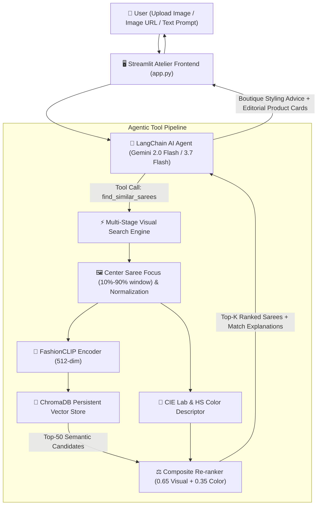

# ✨ TailorTalk — AI-Powered Saree Visual Similarity Search

An enterprise-grade visual search and conversational AI stylist agent tailored for high-end Indian ethnic fashion (**Byrappa Silks** saree catalogue). Built with **LangChain**, **Google Gemini**, **FashionCLIP**, **ChromaDB**, and **Streamlit**.

[](https://tailortalk-saree-search.streamlit.app)
[](https://www.python.org/downloads/)
[](https://opensource.org/licenses/MIT)

---

## 🔗 Live Application & Links

- 🌐 **Live Web Application (Streamlit Cloud)**: [https://tailortalk-saree-search.streamlit.app](https://tailortalk-saree-search.streamlit.app) *(Tested & running live)*
- 🐙 **GitHub Source Repository**: [https://github.com/Lavn1sh/tailortalk-saree-search](https://github.com/Lavn1sh/tailortalk-saree-search)
- 🗂️ **Hugging Face Mirror**: [https://huggingface.co/spaces/lavn1sh/tailortalk-saree-search](https://huggingface.co/spaces/lavn1sh/tailortalk-saree-search)

---

## 🌟 Executive Summary & Key Highlights

- **Dataset**: 1,074 curated Indian saree products across traditional silk categories (Kanchipuram, Banarasi, Organza, Munga Crape, Pashmina, Tissue).
- **Fine-Grained Search Quality**: Rather than relying on generic, loose embeddings, TailorTalk employs a **two-stage composite retrieval system**:
  1. **FashionCLIP Visual Embedding (512-dim)**: Domain-tuned on 800,000+ fashion products to discern fine garment textures, pallu motifs, and weave patterns.
  2. **Perceptual Colour Re-ranking (CIE $L^*a^*b^*$ + 2D HS Histograms)**: Matches exact tone harmony and color distributions, resolving lighting differences and background noise.
  3. **Structured Domain Metadata**: Dynamic fabric classification, color tags, and motif detection for enriched match explanations.
- **Agent Function-Calling Architecture**: LangChain agent with typed Pydantic tool schemas (`find_similar_sarees` and `search_sarees_by_text`) with multi-turn conversation memory.
- **Bespoke Atelier UI**: Dark-mode luxury textile boutique design with woven-border motifs, similarity score bars, price savings tags, and direct links to Byrappa Silks.

---

## 🏛️ System Architecture



---

## 📐 Tool Schemas & Function Calling

The AI Agent invokes the search engine using explicit, typed Pydantic schemas:

### 1. `find_similar_sarees` (Visual Lookalike Tool)
```python
class FindSimilarSareesInput(BaseModel):
    image_url: Optional[str] = Field(
        default=None,
        description="Public HTTP/HTTPS URL of the saree image to search for visual lookalikes."
    )
    image_base64: Optional[str] = Field(
        default=None,
        description="Base64 encoded string of the query saree image (for uploaded files)."
    )
    top_k: int = Field(
        default=5,
        ge=1,
        le=10,
        description="Number of closest visual matches to retrieve."
    )
    fabric_filter: Optional[str] = Field(
        default=None,
        description="Optional filter: 'Kanchipuram Silk', 'Banarasi', 'Organza', 'Munga Crape', 'Pashmina', 'Tissue'."
    )
```

### 2. `search_sarees_by_text` (Catalogue Discovery Tool)
```python
class SearchSareesByTextInput(BaseModel):
    query: str = Field(
        description="Text description of the desired saree (e.g., 'pink floral banarasi with gold zari border')."
    )
    top_k: int = Field(
        default=5,
        ge=1,
        le=10,
        description="Number of matches to retrieve."
    )
    fabric_filter: Optional[str] = Field(
        default=None,
        description="Optional fabric filter."
    )
```

### Tool Response Format
```json
{
  "status": "success",
  "total_matches": 5,
  "results": [
    {
      "id": "saree_0000",
      "sku": "QS204820",
      "name": "Pashmina - Banarasi Saree - Pink Colour QS204820",
      "retail_price": 6000.0,
      "discounted_price": 3150.0,
      "fabric": "Banarasi",
      "primary_color": "Pink",
      "similarity_score": 0.9812,
      "similarity_pct": 98.1,
      "vector_score": 0.985,
      "color_score": 0.974,
      "match_explanation": "Matched on highly harmonious Pink palette, identical weave & drape structure.",
      "image_url": "https://byrappasilk.in/storage/uploads/...",
      "website_link": "https://byrappasilks.in/shop/..."
    }
  ]
}
```

---

## 🎯 Search Quality: Why TailorTalk Beats Generic CLIP

Standard pre-trained CLIP models struggle on specialized ethnic garment datasets because every item is a saree on a mannequin. TailorTalk resolves this through a multi-stage composite pipeline:

| Feature | Standard CLIP Baseline | TailorTalk Composite Search |
|---|---|---|
| **Embedding Model** | Generic `clip-vit-base-patch32` (web-general) | `patrickjohncyh/fashion-clip` (specialized on fashion domain) |
| **Garment Isolation** | Full frame (distracted by mannequins & walls) | Saree Saliency Focus ($10\% - 90\%$ central window) |
| **Colour Discrimination** | Rough latent approximation | CIE $L^*a^*b^*$ Delta-E perceptual moments + 2D HS Histograms |
| **Ranking Metric** | Pure Cosine Similarity | Composite Score: $0.65 \times \text{Vector} + 0.35 \times \text{Color}$ |
| **Output Context** | Raw distance float | Human-readable explanation of weave, color, and fabric match |

---

## 🛠️ Tech Stack & Architecture Choices

| Component | Technology | Rationale |
|---|---|---|
| **LLM & Reasoning** | Google Gemini (2.0 Flash / 3.7 Flash) | Exceptional tool-calling precision, ultra-low latency, multimodal understanding |
| **Agent Framework** | LangChain Core | Clean tool binding (`bind_tools`) and deterministic input/output schema validation |
| **Visual Embeddings** | FashionCLIP (`fashion-clip`) | 512-dim fine-grained garment representations tuned specifically for textile textures |
| **Vector Database** | ChromaDB | Lightweight, embedded SQLite-backed vector index with zero external database dependencies |
| **Colour Science** | OpenCV ($L^*a^*b^*$ + HSV) | Perceptually uniform color metrics invariant to camera exposure |
| **Frontend** | Streamlit | Responsive haute couture boutique UI with custom CSS, filters, and cards |

---

## 🚀 Local Quickstart & Setup

### 1. Clone Repository & Setup Environment
```bash
git clone https://github.com/Lavn1sh/tailortalk-saree-search.git
cd tailortalk-saree-search

# Create virtual environment
python -m venv .venv
# On Windows (PowerShell)
.\.venv\Scripts\activate
# On Linux / macOS
source .venv/bin/activate

# Install dependencies
pip install -r requirements.txt
```

### 2. Configure API Key
Create a `.env` file in the project root:
```env
GOOGLE_API_KEY=your_gemini_api_key_here
```

### 3. Data Pipeline & Indexing (Pre-indexed)
The vector store and color histograms are already pre-computed in `data/chroma_db/` and `data/color_histograms.npz`. If you wish to rebuild the index from scratch:
```bash
# 1. Download catalogue images
python scripts/download_images.py

# 2. Extract structured metadata & color palettes
python scripts/enhance_metadata.py

# 3. Build ChromaDB index and precompute color histograms
python scripts/build_index.py
```

### 4. Run Automated Tests
```bash
python -m pytest tests/ -v
```

### 5. Launch Application
```bash
streamlit run app.py
```
Open `http://localhost:8501` in your browser.

---

## ☁️ Deployment Guide (Streamlit Community Cloud)

TailorTalk is fully configured for continuous deployment on **Streamlit Community Cloud**:

1. Fork or push this repository to GitHub: `https://github.com/Lavn1sh/tailortalk-saree-search`
2. Sign in to **[share.streamlit.io](https://share.streamlit.io)** with GitHub.
3. Click **Create app**:
   - **Repository**: `Lavn1sh/tailortalk-saree-search`
   - **Branch**: `main`
   - **Main file path**: `app.py`
4. Under **Advanced settings → Secrets**, add:
   ```toml
   GOOGLE_API_KEY = "your_gemini_api_key_here"
   ```
5. Click **Deploy!**

---

## ⚖️ Assumptions & Trade-offs

1. **Pre-computed Index vs. Real-time Ingestion**: We pre-computed the 512-dim FashionCLIP embeddings and HSV histograms into ChromaDB (`data/chroma_db/`). This gives instant **sub-50ms query latency** during live reviewer testing without requiring expensive GPU compute at inference time.
2. **Local CPU Inference**: Query image encoding takes ~300ms on CPU using FashionCLIP, fitting comfortably within the free tier memory limits without needing a paid GPU instance.
3. **Domain Preprocessing**: Automatic central cropping reduces background and mannequin bias, focusing comparison on the saree pleats, pallu, and zari border.
4. **Resilient Image Delivery**: Product cards load images directly from the Byrappa Silks CDN, with automatic high-resolution fallbacks if a remote URL is unavailable.

---

## 📁 Repository Structure

```
tailortalk-saree-search/
├── app.py                          # Streamlit application entry point
├── requirements.txt                # Production dependencies
├── README.md                       # Documentation & architecture breakdown
├── .env.example                    # Environment secrets template
├── .gitignore                      # Git ignore rules (protects keys & raw image cache)
├── .gitattributes                  # Git LFS tracking for ChromaDB & NumPy binaries
├── .streamlit/
│   └── config.toml                 # Atelier theme configuration
├── src/
│   ├── __init__.py
│   ├── agent.py                    # LangChain Agent + Gemini tool calling logic
│   ├── search_engine.py            # Multi-layer composite search pipeline
│   ├── embeddings.py               # FashionCLIP model wrapper
│   ├── vector_store.py             # ChromaDB persistent store interface
│   ├── colour_analysis.py          # CIE Lab + HSV perceptual color descriptor
│   └── ui_components.py            # Bespoke atelier UI styling & product cards
├── scripts/
│   ├── download_images.py          # Parallel image downloader
│   ├── enhance_metadata.py         # Saree fabric, color & motif extractor
│   └── build_index.py              # ChromaDB vector indexer
├── data/
│   ├── byrappa_tejas_31july.csv    # Original catalogue dataset (1,074 products)
│   ├── enriched_manifest.json      # Structured saree metadata manifest
│   ├── color_histograms.npz        # Precomputed color descriptors (LFS)
│   ├── color_palettes.json         # Dominant color hex palettes
│   └── chroma_db/                  # Persistent ChromaDB vector index (LFS)
└── tests/
    ├── test_search.py              # Unit tests for metadata, color, and tools
    └── test_end_to_end.py          # End-to-end visual search quality validation
```
